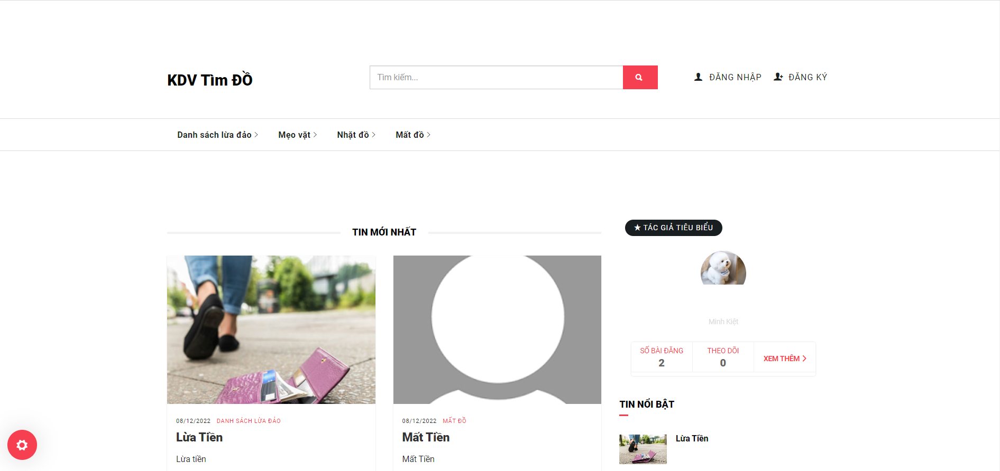
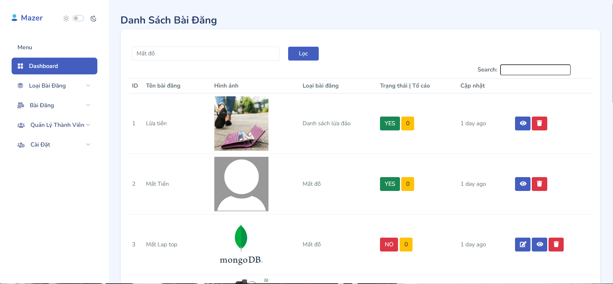

### Đồ án Website tìm đồ thất lạc
---
#### 1.  Giới thiệu thành viên:
- Nguyễn Thành Đạt (nhóm trưởng)
- Lại Minh Kiệt
- Nguyễn Tường Vy
---
#### 2. Giới thiệu dự án:
 Như mọi người đã biết, nhu cầu đi lại, giao thông là việc cần thiết và thiết yếu nhất đối với mỗi người. Song bên cạnh việc đi lại còn có những nhu cầu liên quan khác phát sinh. Ví dụ như việc sửa chữa, rơi mất đồ hay bị cướp giật. Từ xưa đến nay, việc rơi mất đồ hay bị cướp giật là việc đáng quan ngại mà ai cũng không mong muốn nó xảy ra, vì các loại giấy tờ tuỳ thân liên quan sẽ rất khó làm lại mỗi khi bị rơi rớt hay thất lạc dọc đường. Vì vậy, website ***tìm đồ thất lạc*** ra đời với sứ mệnh tìm kiếm lại giấy tờ bị đánh rơi, thất lạc.

---
- **Giao diện chính của người dùng**

---
- **Giao diện quản trị**

---
#### 3. Phân chia công việc:
| STT   | Chức năng | Thành viên | Tiến độ | Trạng thái |
| :---: | :-------: | :--------: | :-----: | :--------: |
| 1 | Đăng nhập | Nguyễn Tường Vy | 60% | Hoàn thành |
| 2 | Đăng ký | Nguyễn Tường Vy | 50% | Hoàn thành |
| 3 | Quản lý thành viên | Nguyễn Tường Vy | 100% | Hoàn thành |
| 4 | Quản lý thành viên quản lý | Nguyễn Tường Vy | 100% | Hoàn thành |
| 5 | Quản lý liên hệ | Nguyễn Tường Vy | 0% | chưa hoàn thành |
| 6 | Cập nhật thông tin | Nguyễn Tường Vy | 100% | Hoàn thành |
| 7 | Viết báo cáo | Nguyễn Tường Vy | 40% / 100% | Hoàn thành |
| 8 | Quản lý loại bài đăng | Lại Minh Kiệt | 100%| Hoàn thành |
| 9 | Quản lý bài đăng | Lại Minh Kiệt | 100%| Hoàn thành |
| 10 | Quản lý tố cáo | Lại Minh Kiệt | 100%| Hoàn thành |
| 11 | Viết báo cáo | Lại Minh Kiệt | 30% / 100% | Hoàn thành |
| 12 | Bình luận | Lại Minh Kiệt | 100% | Hoàn thành |
| 13 | Quản lý bài đăng (Thành viên) | Nguyễn Thành Đạt | 100% | Hoàn thành |
| 14 | Theo dõi bài đăng | Nguyễn Thành Đạt | 100% | Hoàn thành |
| 15 | Quản lý bài đăng theo dõi | Nguyễn Thành Đạt | 100% | Hoàn thành |
| 16 | Đăng nhập | Nguyễn Thành Đạt | 40% | Hoàn thành |
| 17 | Đăng ký | Nguyễn Thành Đạt | 50% | Hoàn thành |
| 18 | Tìm kiếm bài đăng | Nguyễn Thành Đạt | 100% | Hoàn thành |
| 19 | Tìm kiếm theo vị trí | Nguyễn Thành Đạt | 0% | Chưa hoàn thành |
| 20 | Tố cáo bài đăng | Nguyễn Thành Đạt | 100% | Hoàn thành |
| 21 | Các chức năng xem bài đăng | Nguyễn Thành Đạt | 100% | Hoàn thành |
| 22 | Đăng bài | Nguyễn Thành Đạt | 100% | Hoàn thành |
| 23 | Phân tích dự án | Nguyễn Thành Đạt | 100% | Hoàn thành |
---
#### 4. Cài đặt dự án:
1. Clone dự án về máy 
2. Download file cơ sở dữ liệu [get link](https://drive.google.com/file/d/1xjawvBNofx_KbCEa-sJmgzeP3rZINoh5/view?usp=share_link)
3. Chạy truy vấn mysql với file vừa download
4. Chạy dự án và thử nghiệm

---

# Cảm Ơn Đã Xem
